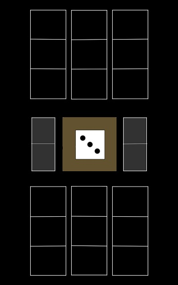
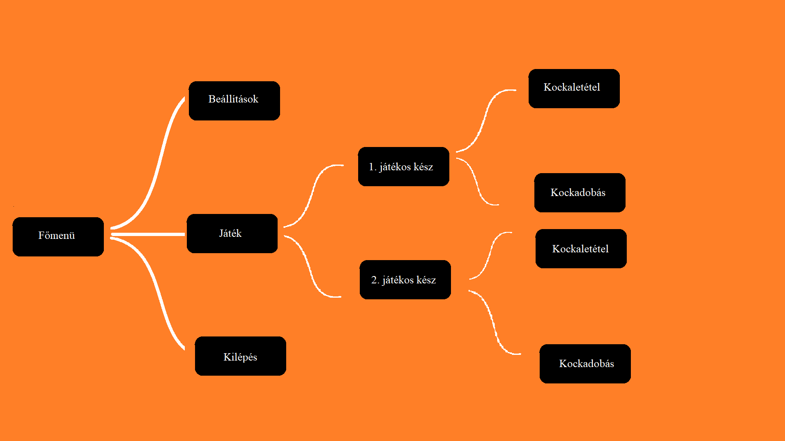

# Funkcionális Specifikáció

### Áttekintés
Az általunk fejlesztett program egy amőbához hasonló puzzle game.
A játékot 2 játékos játsza egy-egy 3x3-as játékostáblán, felváltva dobnak, majd a dobás eredményét el tudják helyezni saját táblájukon.
Ezáltal pontokat tudnak szerezni, azonban bukhatunk is pontokat, ha a másik játékos ugyanazon oszlopba rakja le a miénkkel megegyező számát.
A játék akkor ér véget, ha a tábla betelik, ekkor az a játékos nyer, akinek több pontja van.
Alapja a Cult of the Lamb nevű játék minijátéka, azonban a mini-gamenek nem volt kihatása a fő történetszálra.
Ezért elhatározzuk, megcsináljuk az önálló mobilos változatát, mivel egy klassz egyedi mobiljáték is lehetne.
Lesz saját felhasználói felülete, például különböző gombok, melyen keresztül vezérelni lehet a játékot.

### Jelenlegi helyzet leírása
Egy telefonos alkalmazásokat készítő kisvállalkozás vagyunk, akik szeretnének belépni egy játékkal a mobil játékiparba.
Ez az első projektünk, és reméljük, hogy megállja majd a helyét a nagyobb cégek termékeivel szemben.

### Vágyálom rendszer leírása
A projektünk egy amőbához hasonló egyszerű kétszemélyes puzzle játék lesz.
A játék két 3x3-as táblán játszódik. A játékosok felváltva dobnak egy dobókockával, és a dobás eredményét
elhelyezik a saját táblájuk megfelelő cellájában. A lerakott számok az adott játékos pontszámaihoz adódnak hozzá.
Egy oszlopban 2 vagy 3 ugyanolyan szám lerakásával a megegyező számok összeszorzódnak, ezáltal a kapott pontszám is többszöröződik.
Ha a lerakott szám a másik játékos táblájában is szerepel ugyanazon oszlopban, akkor az a szám és az általa szerzett pontszám a másik játékostól elveszik.
Akkor ér véget a játék, ha valamelyik játékos táblája megtelik, és a győzelem azé lesz, akinek több pontja van ekkor.

### Jelenlegi üzleti folyamatok modellje
A leírt játék a Cult of the Lamb indie videójáték mini-játéka, a mini-játék funkciói:
+ Kockadobás: automatikusan történik minden egyes kör elején => beírandó érték meghatározása
+ Érték beírás: kockadobás után történik => a játékos választja ki, hogy melyik oszlopba akarja rakni a számot
+ Pontszámítás: automatikusan történik az érték beírása után, attól függően
+ Pontvesztés: automatikusan történik, ha játékos2 egy olyan oszlopba rak egy értéket, ahol már játékos1nek szerepel a saját táblájában vele megegyező értéke
+ Győztes meghatározása: pontszám alapján automatikusan történik, miután valamelyik játékos betelítette teljesen a tábláját

### Igényelt üzleti folyamatok modellje
- Elkészíteni a fenti mini-játék önálló verzióját: megvalósítani, hogy Android operiációs rendszeren egy különálló játékként tudjuk játszani
a mini-játékot
- Más emberek ellen történő játék lehetővé tétele: 2 ember ugyanazon eszközön körökre osztva 
- Saját felhasználói felület megléte: az eredeti mini-játékéhoz hasonló kezelőfelület

### Követelménylista
- Egyszerű kezelőfelület
- Többjátékos mód
- Részletes design

### Funkció - követelmény megfeleltetés
- Főmenü: egy játék kezdése gomb, egy beállításokhoz vezető gomb és egy kilépés gomb.
- Kockadobás: a kör kezdetekor a játék automatikusan dob egyet a kockával. A dobás után a táblára kell húzni a kidobott kockát.
- Pontszámító: a táblára helyezett kidobott kockák értékeinek hozzáadása a játékos pontszámához. Egy oszlopba helyezett,
azonos értékeket továbbá megszorozzuk a következő szabályok szerint: két azonos érték esetén (a lerakott szám) x4, 3 azonos érték
esetén (a lerakott szám) x9. Ha egy adott oszlopba lerakott érték szerepel a másik játékos tábláján ugyanezen oszlopban,akkor a
másik játékos tábláján ezen oszlopban minden ilyen érték törlődik, és a pontszámuk is átszámolásra kerül.
- Pontok megjelenítése: mindkét játékos pontszámát megjeleníti egy-egy a játékos felé fordított szövegmező.
- Játék vége: a játék véget ér, ha valamelyik játékos táblája megtelik. Ekkor a pontszámaik alapján eldől, hogy ki a nyertes.

### Képernyő terv
A játéktér 3 fő részből áll:

1. A játékosok rendelkeznek egy-egy 3x3-as játéktáblával, amelybe a dobott számokat elhelyezhetik
2. A játéktér közepén lévő kockával dobhatnak körönként a játékosok
3. A kocka jobb és bal oldalán egy-egy a játékosok felé fordított pontszámtáblán jelzi a játék a jelenlegi játék-állást

A játékból való kilépésre az eszközön lévő vissza gombbal érhetünk el egy kilépés gombot.

### Használati esetek

A játékosok egy eszközt fognak használni, ezért egy játékos is elég a játék elindításához a menüből. Innen elérhető még egy beállítások és egy kilépés opció is.
A játékon belül a játékosok dobhatnak a képernyő közepén lévő kockával és elhelyezhetik a dobott számot a táblájukon.