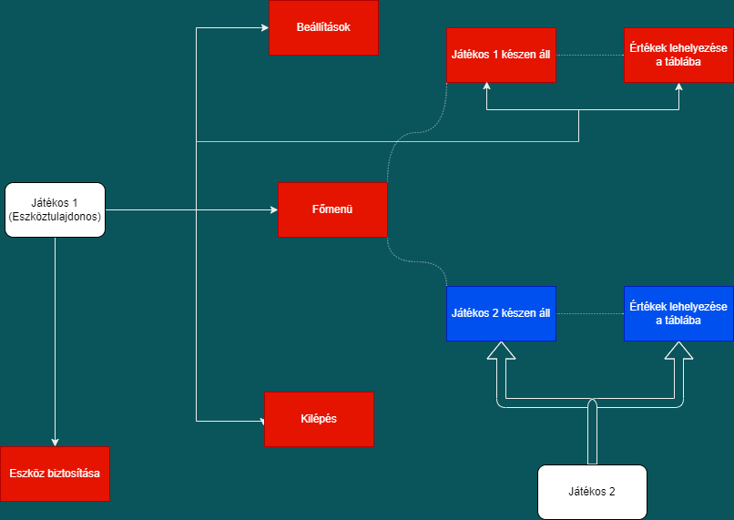

# Rendszerterv

### A rendszer célja

A rendszer célja, hogy a Cult of the Lamb játékban a "Knucklebones" nevezetű mini-játékot egy különálló,
Andoird platformon elérhető játékká tegye. A rendszer lemásolja egészében vagy részleteiben az eredeti mini-játék
mechanikáit és felhasználói funkcióit, a játékszabályok nem változnak. A felhasználói felületet is az eredetihez
hasonlóvá tesszük kisebb különbségekkel. Az eredeti játékkal ellentétben itt két játékos játszhat egymás ellen
egy eszközt együttesen használva, nem pedig egy AI ellenfél ellen.

A játék rendelkezni fog saját főmenüvel és beállítási lehetőségekkel. Az eredeti játék egérrel történő irányításait
érintőképernyős megoldások és UI elemek fogják reprodukálni. A felhasználói felület színeit az eredeti játékbeli mini-játék
alapján választjuk.

### Üzleti folyamatok modellje

### Követelménylista

- Egyszerű kezelőfelület

- Többjátékos mód

- Részletes design

### Funkcionális terv

* Játékos 1 (eszköz tulajdonos):

  * Ő biztosítja az eszközt

  * Kezeli a játék beállításait

  * Elindíthatja a játékot

  * Játékon belül értékeket raknak le

* Játékos 2:

  * Az eszköz tulajdonos ellen versenyzik

  * Játékon belül értékeket raknak le

Menük:

* Főmenü:

  * Játék indítása
  
  * Beállítások

  * Kilépés

* Játék felület:

  * A játék felület közepén van a kocka amit a rendszer automatikusan  dob ha a játékos lerakott egy értéket

  * A kocka két oldalán a számláló mutatja a játékosok pontjait

  * A számláló és a kocka alatt illetve felett helyezkednek el a játékosok táblái amiken elhelyezhetik az értékeket

### Fizikai környezet

* Az alkalmazás android rendszerre fog készülni

* Külső komponensek:

  * hang effektek

* Fejlesztői eszközök:

  * Android Studio
  
  * Maven
  
### Telepítési terv

A játék Android platformra telepíthető

- Az alkalmazás nem Google Play-en keresztül elérhető.

- Elérés módja: Az alkalmazás Github tárolóján keresztül letölthető

- Beállításokban a telepítéshez engedélyezni kell a 3. féltől származó tartalmakat

- Telepítéshez a letöltött ".apk" állományt kell futtatni

## Karbantartási terv

- Fix időszakonként ellenőrizni fogjuk hogy a játék egyes funkciói megfelelően működnek-e, ellátják-e szükséges feladataikat, nem történik-e váratlan hiba

- Ellenőrizzük, hogy jövőben kiadott Android verziókkal kompatibilis legyen

- Új képernyő méret szabványok megjelenése esetén a felhasználói felület elemeire vonatkozóan biztosítjuk a rezponzivítást

- A keletkező hibákat, bugokat a lehető leghamarabb próbáljuk kijavítani